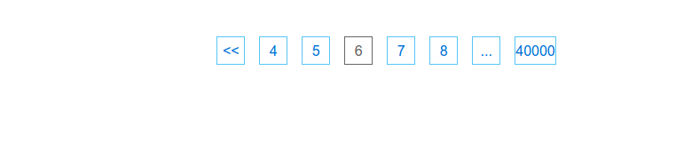
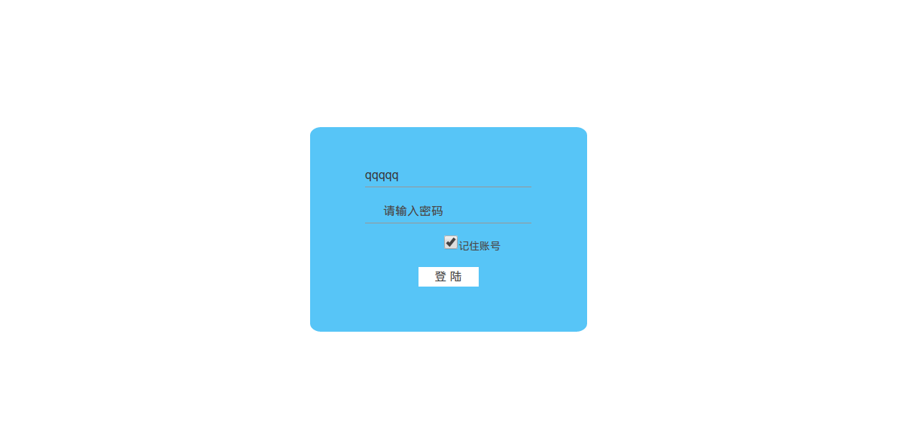

# componentization

### 安装
```
npm install --save laolu87/componentization
```

### 删除
```
npm uninstall --save componentization
```

### webpack设置文件添加对css文件支持(如果没有的话)
```
//npm 安装style-loader和css-loader
npm install --save-dev style-loader css-loader

//在webpack.config.js里面的loaders里面添加css文件支持
    loaders: [
        {
        test: /\.css$/,
        loader: 'style!css'
      }
    ]
```

### 引入组件
```
import {Login} from 'componentization'
require('componentization/styles/login.css')
//或
import {Login} from 'componentization/component/Login'
require('componentization/styles/login.css')
```

### pager组件(分页组件)

```
参数:
total: 总条目数      Number类型
pageSize: 每页显示的条目数     Number类型
current: 当前页码,必须是大于零的整数     Number类型
onClick: 点击页面触发的函数,拥有一个被点击页码数的参数    Function类型


示例:
import React from 'react'
import {Pager} from 'componentization'
require('componentization/styles/pager.css')
let PagerTest = React.createClass({
  getInitialState(){
    return {
      currentpage: 1
    }
  },
  onClick(page){
    this.setState({
      currentpage: page
    })
  },
  render(){
    return (
      <div style={{textAlign: 'center'}}><Pager total={200000} pageSize={5} current={this.state.currentpage} onClick={this.onClick} /></div>
    )
  }
})

export default PagerTest
```

#### Login组件,带状态(ui+state状态处理了记住账号的逻辑)

```
import React from 'react'
import {Login} from 'componentization'
require('componentization/styles/login.css')

let Loginbox = React.createClass({
//按空格键或者点击登陆按钮会触发这个函数
  handlesubmit(value){
  //参数value会接收账号和密码输入框的值组成一个对象.
    console.log(value)
    //Object {username: "????", password: "????"}
  },

  render(){
    return (
      <div><Login handlesubmit={this.handlesubmit} /></div>
    )
  }
})

export default Loginbox
```

#### LoginUi组件(Login组件的无state实现)

```
//由于无状态,状态应该自行定义:
//接收三个必选参数
// handlesubmit:为一个函数,点击登陆按钮触发
// checked:为一个布尔值,用于判定记住账号是否为勾选状态
// setChecked:辅助判定是否记住账号

//示例:
import React from 'react'
import {LoginUi} from 'componentization'
require('componentization/styles/loginui.css')
let Loginbox = React.createClass({
  getInitialState(){
    return {
      checked: false
    }
  },

    componentDidMount(){
    if(!!localStorage.getItem('username')){
      this.setState({
        checked: true,
      })
    }
  },

  handlesubmit(value){
    console.log(value)
  },

  setChecked(checked){
    this.setState({
      checked: checked
    })
  },

  render(){
    return (
      <div><LoginUi handlesubmit={this.handlesubmit} checked={this.state.checked} setChecked={this.setChecked}/></div>
    )
  }
})

export default Loginbox
```

#### Select组件

```
参数:
options:下拉的菜单内容,数组
defaultValue:默认选中项(可选参数,没有这个参数时默认选中项为第一项)
onChange:选中时触发的函数,拥有一个value参数,为当前选中项的value值.


示例:
import React from 'react'
import {Select} from 'componentization'
let SelectTest = React.createClass({
  getInitialState(){
    return {
      select:[
        {value:1, children:'Volvo'},
        {value:2, children:'saad'},
        {value:3, children:'opel'},
        {value:4, children:'Audi'}
      ],
      value:4
    }
  },

  onChange(value){
    console.log(value)
  },

  render(){
    return (
      <div><Select options={this.state.select} defaultValue={this.state.value} onChange={this.onChange}/></div>
    )
  }
})

export default SelectTest
```
